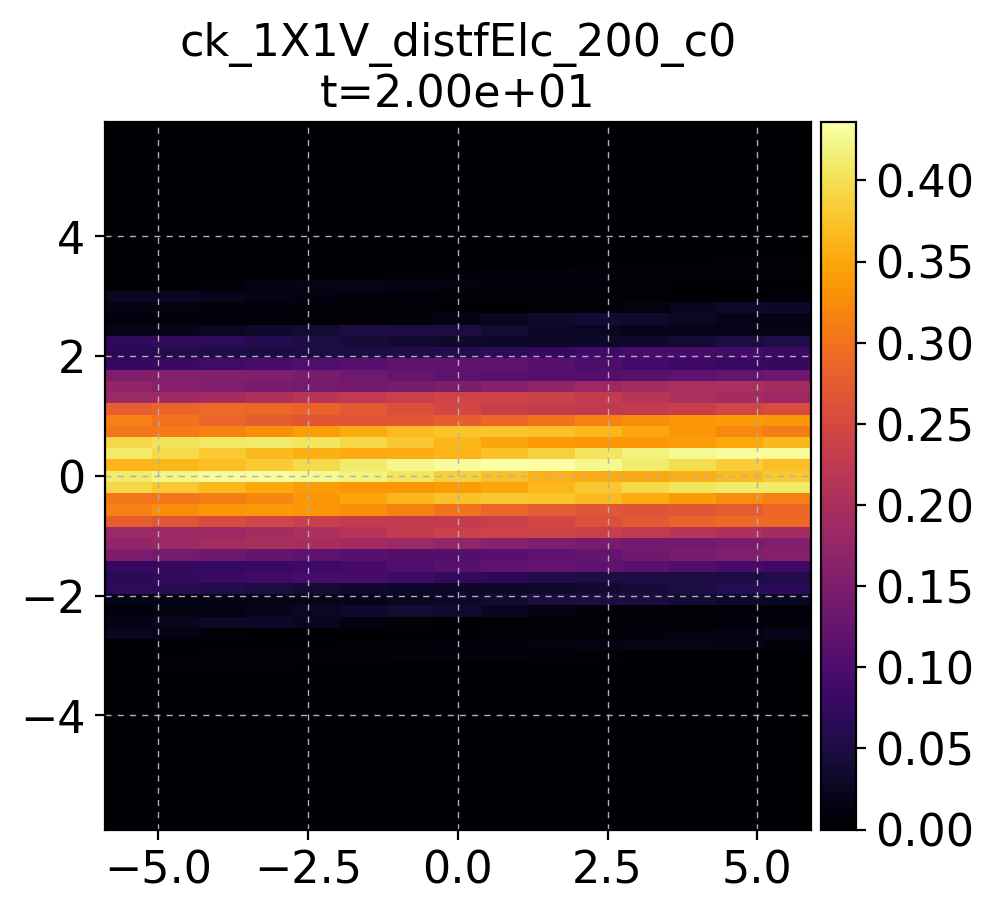
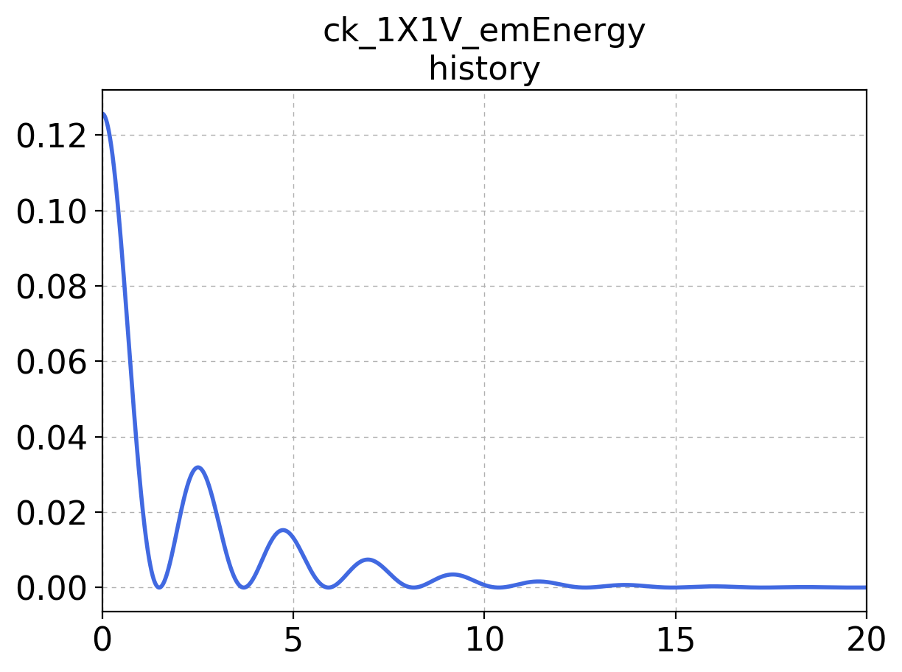
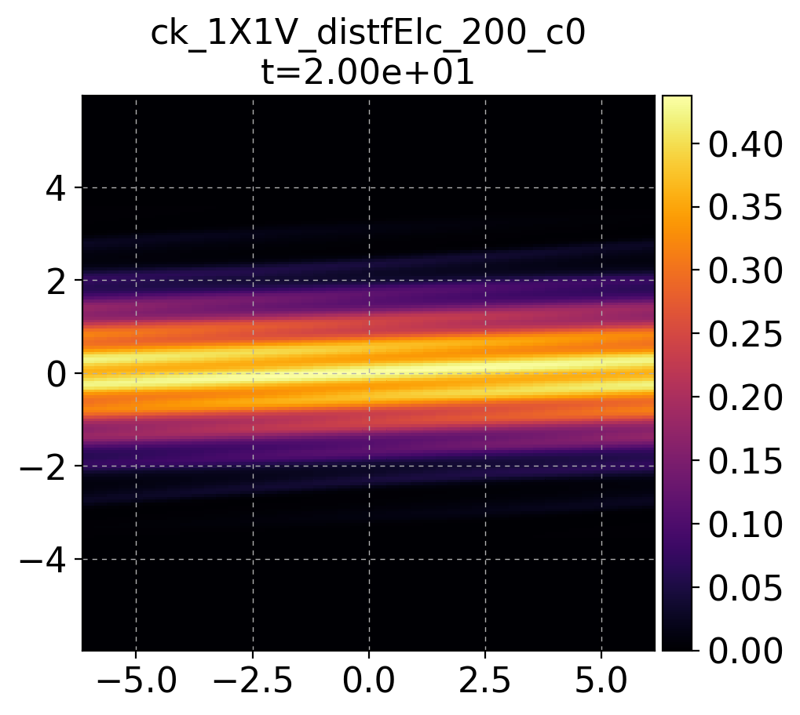
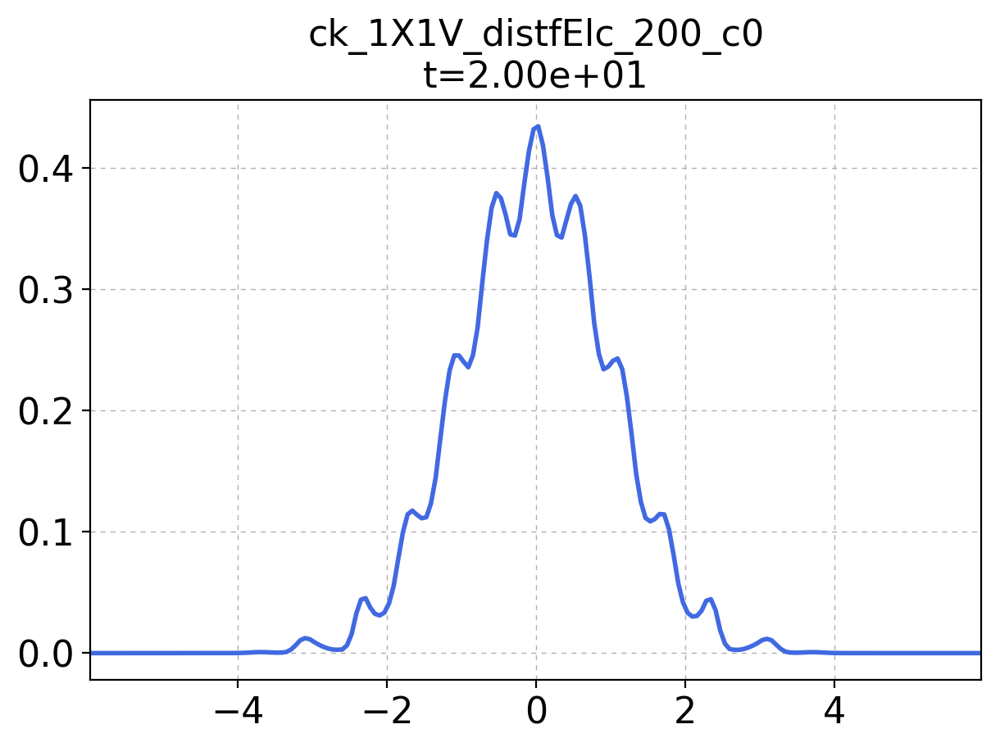
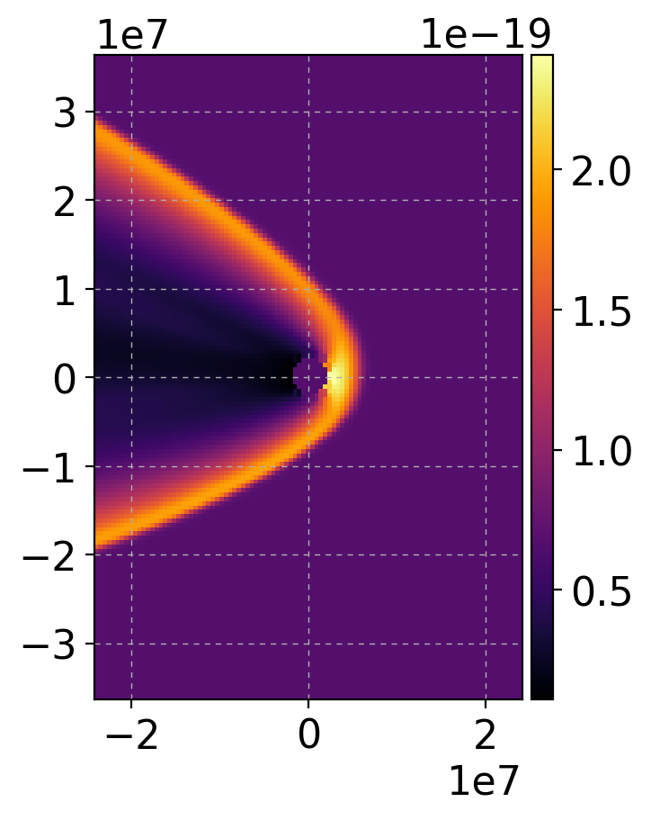
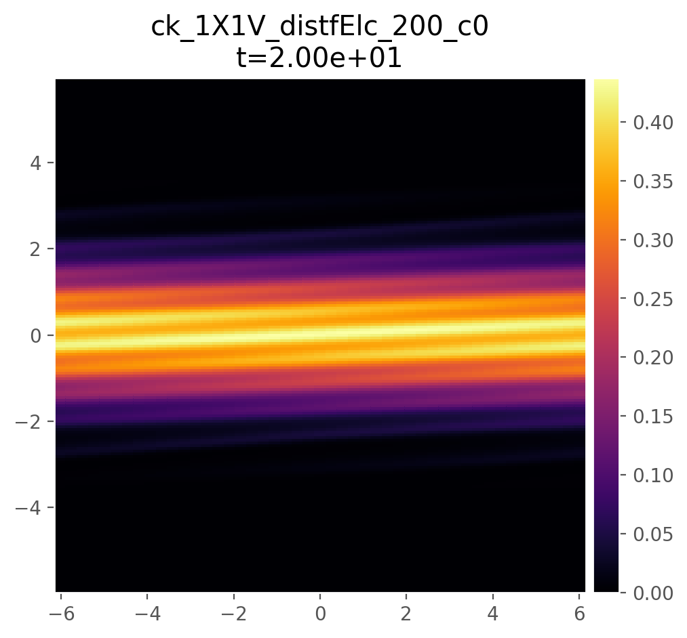
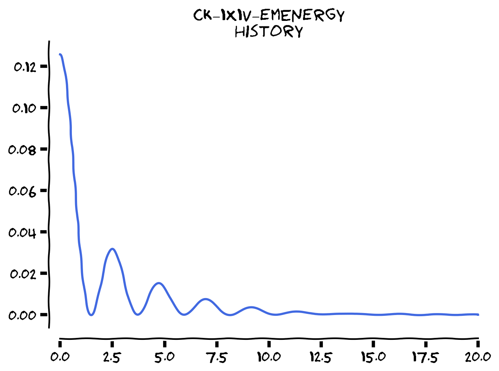

*********
Tutorials
*********

This document provides basic tutorials for different parts of
Postgkyl.

Navigate this page:

.. contents::
   :local:
   :depth: 2
   :backlinks: top

Gplot script
============

``gplot.py`` is a high-level command line script located in the
package's root directory. It is designed to provide quick access to
data loading, discontinuous Galerkin data projections, and
plotting. Script behavior is controlled by flags.

Help containing the usage and a list of all flags with brief
descriptions can be opened with

.. code-block:: bash

   python gplot.py -h

Basic plotting
--------------

The data file for the baseline plotting is specified with ``--plot``
or ``-p``

.. code-block:: bash

   python gplot.py -p ck_1X1V_distfElc_200.h5

This command will produce a figure looking similar to the following

There are a few things worth mentioning on this plot. The title is
automatically generated from the name of the file with a component
index attached to the end. The plot in this example is a distribution
function after a Landau damping and has only one component so it
wasn't specified and the default component 0 was used. An example of a
field with multiple components is a field of conserved variables in a
fluid simulation which typically contains density, momenta, and
energies, or electro-magnetic fields. The component can be specified
with flags ``--component`` or ``-c``. The second line of the title is
the time obtained from the output file.

Title and grid are by default on and can be turned of by flags
``--no-title`` and ``--no-grid`` respectively. Axis labels can be
specified with ``--xlabel`` and ``--ylabel``.

.. note:: Postgkyl is by default using the new perceptually uniform
	  `Matplotlib 2 <http://matplotlib.org/>`_ colormap called
	  ``inferno``. More information about the colormaps can be
	  found `here <https://bids.github.io/colormap/>`_. #jetsucks

Gkeyll/Gkyl ``DynVector`` history plots are available through flags
``--history`` or ``-y``.  Following is the electric field energy
evolution of the previous Landau damping simulation

.. code-block:: bash

   python gplot.py -y ck_1X1V_emEnergy

In the background, Gplot is using the module ``glob`` to look for the
files with the specified name root and then sorts them based on their
time. Therefore, it is not susceptible to any particular naming
convention for example ``ck_1X1V_emEnergy_0.h5`` vs
``ck_1X1V_emEnergy_0000.h5``.  Also, the following script would
produce the same plot

.. code-block:: bash

   python gplot.py -y emEnergy

Projections
-----------

In its base-line mode Gplot treats all output files as fine-volume
data and plots only one value per cell (specified by the component
index mentioned above). However, the previous example is, in reality, a
discontinuous Galerkin finite-elements simulation on the second order
nodal Serendipity basis which contains eight nodal values per cell. Gplot
can use Postgkyl's projection capabilities to provide a more fitting
plot

.. code-block:: bash

   python gplot.py -p ck_1X1V_distfElc_200.h5 --ns=2

There are currently three flags for three DG basis supported in Gkeyll/Gkyl:

 * Nodal Serendipity ``--ns=<polyOrder>``
 * Modal Serendipity ``--ms=<polyOrder>``
 * Modal Maximal Order ``--mo=<polyOrder>``

Slicing
-------

Gplot has a built-in function for plotting slices of the
multi-dimensional data by fixing set variables. For example, a
lineout of the previous plot for :math:`x=0.0` can be plotted with 

.. code-block:: bash

   python gplot.py -p ck_1X1V_distfElc_200.h5 --ns=2 --fix1=0.0

Coordinates are 1-indexed so in this case ``--fix1`` corresponds to
:math:`x` and ``--fix2`` to :math:`v_x`.

Masking
-------

Gplot supports masking with the flags ``--mask`` or ``-m``. The left
figure is without any mask; the right is with the masking applied.

.. code-block:: bash
		
   gplot -p m1-mf-mercury_q_20.h5 -m m1-mf-mercury_inOut.h5 

.. image:: img/tutorials/gplot_mask2.png
   :width: 49% 

Style sheets
------------

Matplotlib `style sheets
<http://matplotlib.org/users/style_sheets.html>`_ are available in
Gplot with the flag ``--style``. The following plot was, for example,
a style `ggplot <http://ggplot2.org/>`_ that emulates aesthetics of a
plotting package for `R <https://www.r-project.org/>`_.

.. code-block:: bash

   python gplot.py -p ck_1X1V_distfElc_200.h5 --ns=2 --style=ggplot

xkcd plots
----------

Last but not least, Gplot fully supports the `xkcd
<http://www.xkcd.com>`_ style plots with a mystical, whimsical and
slightly nonsensical flag ``-x``!

The style of lines, axis, and colorbars is a default part of the
Matplotlib, however, the font ``Humor Sans`` is not. The font can be
downloaded from many places, for example `here
<https://github.com/shreyankg/xkcd-desktop/blob/master/Humor-Sans.ttf>`_.
After the installation, the Matplotlib font cache needs to be rebuilt

.. code-block:: python

   import matplotlib.font_manager as fm
   fm._rebuild()

Sometimes, it is necessary to copy the font file into
``path_to_anaconda/lib/python3.6/site-packages/matplotlib/mpl-data/fonts/ttf/``

Data module
===========

Diagnostics module
==================

Tools module
============
